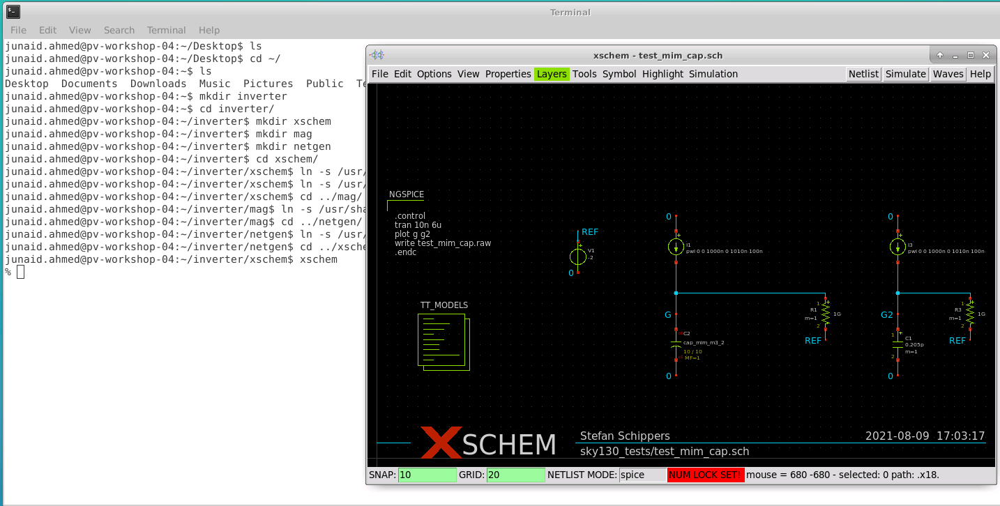

# Physical Verification using SKY130
# Table of Contents

1. Lab1 (Tool installation and basic LVS/DRC design flow)
   - PV_D1SK2_L1 - Check Tool Installations
   - PV_D1SK2_L2 - Creating Sky130 Device Layout In Magic
   - PV_D1SK2_L3 - Creating Simple Schematic In Xschem
   - PV_D1SK2_L4 - Creating Symbol And Exporting Schematic In Xschem
   - PV_D1SK2_L5 - Importing Schematic To Layout And Inverter Layout Steps
   - PV_D1SK2_L6 - Final DRC/LVS Checks And Post Layout Simulations
  
2. Lab2 (Labs for GDS read/write, extraction, DRC, LVS and XOR setup)
   - PV_D2SK2_L1 - GDS Read
   - PV_D2SK2_L2 - Ports
   - PV_D2SK2_L3 - Abstract Views
   - PV_D2SK2_L4 - Basic Extraction
   - PV_D2SK2_L5 - Setup For DRC
   - PV_D2SK2_L6 - Setup For LVS
   - PV_D2SK2_L7 - Setup For XOR

3. Lab3 (Labs for all DRC rules)
   - PV_D3SK2_L1 - Lab For Width Rule And Spacing Rule
   - PV_D3SK2_L2 - Lab For Wide Spacing Rule And Notch Rule
   - PV_D3SK2_L3 - Lab For Via Size, Multiple Vias, Via Overlap and Autogenerate Vias
   - PV_D3SK2_L4 - Lab For Minumum Area Rule And Minimum Hole Rule
   - PV_D3SK2_L5 - Lab For Wells And Deep N-Well
   - PV_D3SK2_L6 - Lab For Derived Layers
   - PV_D3SK2_L7 - Lab For Paramterized And PDK Devices
   - PV_D3SK2_L8 - Lab For Angle Error And Overlap Rule
   - PV_D3SK2_L9 - Lab For Unimplemented Rules
   - PV_D3SK2_L10 - Latch-up And Antenna Rules
   - PV_D3SK2_L11 - Lab For Density Rules

4. Lab5 (LVS labs)
   - PV_D5SK2_L1 - Simple LVS Experiment
   - PV_D5SK2_L2 - LVS With Subcircuits
   - PV_D5SK2_L3 - LVS With Blackboxes Subcircuits
   - PV_D5SK2_L4 - LVS With SPICE Low Level Components
   - PV_D5SK2_L5 - LVS For Small Analog Block - Power-On Reset - Part 1
   - PV_D5SK2_L6 - LVS For Small Analog Block - Power-On Reset - Part 2
   - PV_D5SK2_L7 - LVS Layout Vs Verilog For Standard Cell
   - PV_D5SK2_L8 - LVS For Macros
   - PV_D5SK2_L9 - LVS Digital PLL - Part 1
   - PV_D5SK2_L10 - LVS Digital PLL - Part 2
   - PV_D5SK2_L11 - LVS With Property Errors

## Lab1 (Tool installation and basic LVS/DRC design flow)
### PV_D1SK2_L1 - Check Tool Installations

- xschem
First of all, xschem steup is checked by using the following commad:  
<i>xschem</i>  
<i>xschem –tcl test.tcl -q</i>  

