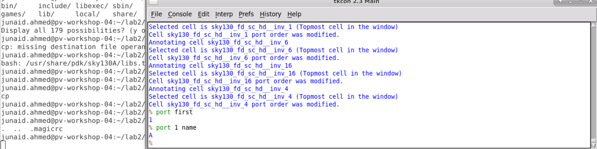

# Physical Verification using SKY130
# Table of Contents

1. Lab1 (Tool installation and basic LVS/DRC design flow)
   - PV_D1SK2_L1 - Check Tool Installations
   - PV_D1SK2_L2 - Creating Sky130 Device Layout In Magic
   - PV_D1SK2_L3 - Creating Simple Schematic In Xschem
   - PV_D1SK2_L4 - Creating Symbol And Exporting Schematic In Xschem
   - PV_D1SK2_L5 - Importing Schematic To Layout And Inverter Layout Steps
   - PV_D1SK2_L6 - Final DRC/LVS Checks And Post Layout Simulations
  
2. Lab2 (Labs for GDS read/write, extraction, DRC, LVS and XOR setup)
   - PV_D2SK2_L1 - GDS Read
   - PV_D2SK2_L2 - Ports
   - PV_D2SK2_L3 - Abstract Views
   - PV_D2SK2_L4 - Basic Extraction
   - PV_D2SK2_L5 - Setup For DRC
   - PV_D2SK2_L6 - Setup For LVS
   - PV_D2SK2_L7 - Setup For XOR

3. Lab3 (Labs for all DRC rules)
   - PV_D3SK2_L1 - Lab For Width Rule And Spacing Rule
   - PV_D3SK2_L2 - Lab For Wide Spacing Rule And Notch Rule
   - PV_D3SK2_L3 - Lab For Via Size, Multiple Vias, Via Overlap and Autogenerate Vias
   - PV_D3SK2_L4 - Lab For Minumum Area Rule And Minimum Hole Rule
   - PV_D3SK2_L5 - Lab For Wells And Deep N-Well
   - PV_D3SK2_L6 - Lab For Derived Layers
   - PV_D3SK2_L7 - Lab For Paramterized And PDK Devices
   - PV_D3SK2_L8 - Lab For Angle Error And Overlap Rule
   - PV_D3SK2_L9 - Lab For Unimplemented Rules
   - PV_D3SK2_L10 - Latch-up And Antenna Rules
   - PV_D3SK2_L11 - Lab For Density Rules

4. Lab5 (LVS labs)
   - PV_D5SK2_L1 - Simple LVS Experiment
   - PV_D5SK2_L2 - LVS With Subcircuits
   - PV_D5SK2_L3 - LVS With Blackboxes Subcircuits
   - PV_D5SK2_L4 - LVS With SPICE Low Level Components
   - PV_D5SK2_L5 - LVS For Small Analog Block - Power-On Reset - Part 1
   - PV_D5SK2_L6 - LVS For Small Analog Block - Power-On Reset - Part 2
   - PV_D5SK2_L7 - LVS Layout Vs Verilog For Standard Cell
   - PV_D5SK2_L8 - LVS For Macros
   - PV_D5SK2_L9 - LVS Digital PLL - Part 1
   - PV_D5SK2_L10 - LVS Digital PLL - Part 2
   - PV_D5SK2_L11 - LVS With Property Errors

## Lab1 (Tool installation and basic LVS/DRC design flow)
### PV_D1SK2_L1 - Check Tool Installations

#### xschem (for schemtic design)  
First of all, xschem steup is checked by using the following commad:  
- <i>xschem</i>  
- <i>xschem –tcl test.tcl -q</i>  

#### netgen (for LVS)
netgen is checked by using the following commad:  
- <i>netgen</i>  

#### ngspice (for simulation)
ngspice is checked by using the following commad:  
- <i>ngspice</i>  

#### magic (for layout design and extraction)
magic is checked by using the following commad:  
<i>magic</i>  
- </i>  magic -noconsole</i>  
- </i>  magic -dnull -noconsole  (without graphics)</i>  
- </i>  magic -dnull -noconsole test.tcl</i>  

### PV_D1SK2_L2 - Creating Sky130 Device Layout In Magic
#### For layout cration we have used the following commands:
- </i> magic -d XR (icons colors are saturated)</i> 
- </i>magic -d OGL</i> 
- </i>U -> undo</i> 
- </i>P -> fill color</i> 
- </i>Z zoom in</i> 
- </i>shift+Z (zoom out)</i> 
- </i>E to erase</i> 
- </i>:erase on command window</i>  
  

#### Modifying properties of sky130 standard cells:  
  
  
  

###  PV_D1SK2_L3 - Creating Simple Schematic In Xschem
Schematic of inverter has been designed in xschem, two transistor symbols have been used: pfet_01v8 and nfet_01v8. Transistor parameters have been modified. Final schematic have been exported as symbol for simulation in testbench.
  

###  PV_D1SK2_L4 - Creating Symbol And Exporting Schematic In Xschem
A testbench circuit has been developed and schematic of inverter has been imported. Two power sources has been applied, one with constant volatage source, because the pfet and nfet are designed for that and second source voltage is sweep on the gate terminal of each device to check the final outcome.  
    
    

###  PV_D1SK2_L5 - Importing Schematic To Layout And Inverter Layout Steps
Now inverter netlist has been exported from xschem to magic as shown below, all blocks have been arragned and connection have been made.
    
    

###  PV_D1SK2_L6 - Final DRC/LVS Checks And Post Layout Simulations
Now layout is complete, at this point we are not checking drc errors, although there is no drc error in this layout. The following commands are used for extract the final layout netlist for layout to schematic comparison:
- </i>extract do local (extract in local directory)</i>
- </i>extracl all</i>
- </i>ext2spice lvs (extract for lvs)</i>
- </i>ext2spice (final extraction)</i>

For comparison in netgen we have used following command:
- </i>netgen -batch lvs “../mag/inverter.spice inverter” “../xschem/inverter.spice inverter”</i>
  

## Lab2 (Labs for GDS read/write, extraction, DRC, LVS and XOR setup)
### PV_D2SK2_L1 - GDS Read
- </i>cif listall istyle: to get list of all known styles for gdsv
- </i>cif list istyle: current set style</i>
- </i>cif istyle xxx: current and all possible styles</i>
- </i>gds read /usr/share/pdk/sky130A/libs.ref/sky130_fd_sc_hd/gds/sky130_fd_sc_hd.gds</i>
After loading gds, we have seleted a standard cell: sky130_fd_sc_hd__and2_1
   
Now change the style to vendor and read again
- </i>cif istyle gds(vendor)</i>
   
- </i>gds noduplicates (check cells can be override or not)</i> 
- </i>gds noduplicates true (current cell will not update)</i>
   

### PV_D2SK2_L2 - Ports
Port index is meta data so it cannt be stored in gds. It can be checked using following commands
- </i>Port index</i>
- </i>port first</i>
- </i>port 1 name</i>
- </i>port 1 class (meta data)</i>
- </i>port 1 use (meta data)</i>
   
Meta data can be found in lef file.
- </i>lef read /usr/share/pdk/sky130A/libs.ref/sky130_fd_sc_hd/lef/sky130_fd_sc_hd.lef</i>
   
   
   

### PV_D2SK2_L3 - Abstract Views
### PV_D2SK2_L4 - Basic Extraction
### PV_D2SK2_L5 - Setup For DRC
### PV_D2SK2_L6 - Setup For LVS
### PV_D2SK2_L7 - Setup For XOR
